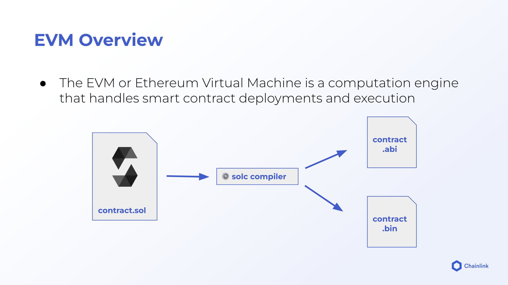

Whenever we compile our smart contract it will be compiled to EVM compatible code
(Ethereum Virtual Machine)

# Contract Compilation

Whenver a contract is deployed. 2 files will be generated `contract.abi` and `contract.bin`

`contract.bin` will contain fields such as `object` and `opcodes`  
Object -> will contain the binary of the contract.  
Opcodes -> will contain the exact opcodes.

When we deploy a contract.
`contract.bin` is sent to the blockchain

---

# Transaction Fields

-   When we deploy a contract, `data` field will be populated with `contract init code`and`contract byte code`
-   To field will be empty

-   EVM will read the opcodes
